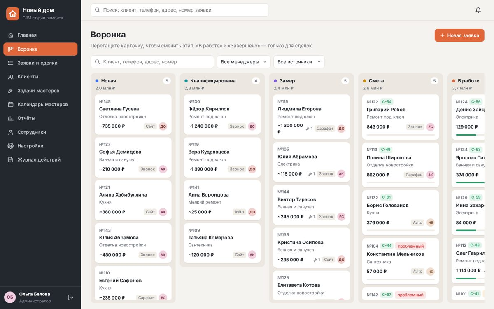
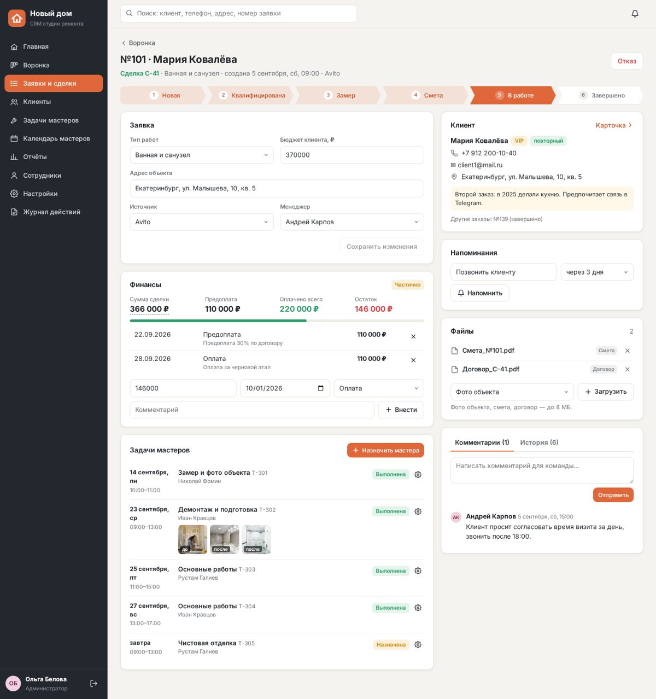
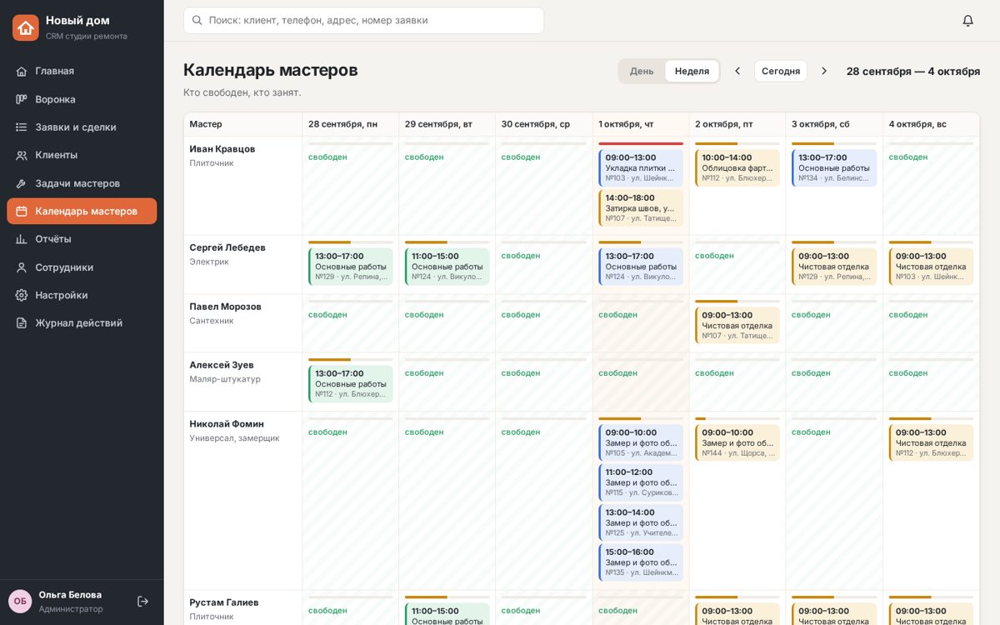

# Новый дом · CRM — CRM для студии ремонта

Внутренняя CRM для студии ремонта квартир: заявка с сайта или звонка → воронка этапов → сделка → задачи мастерам → оплата → отчёт.
MVP по реальному заказу с FL.ru («CRM для студии ремонта — от заявки до закрытия заказа»).

**Демо:** _ссылка появится после публикации_. Пароль у всех демо-пользователей: `remont`.

| Логин | Роль | Что видит |
|---|---|---|
| `admin` | Администратор | всё: воронка, отчёты, сотрудники, настройки, журнал действий |
| `manager` | Менеджер | только свои заявки, сделки и клиентов; календарь мастеров |
| `master` | Мастер | только свои задачи: принять / отклонить / начать / выполнено, фото «до/после» |
| `client` | Клиент | статус своего заказа, визиты мастеров, оплаты, фото и документы |



## Что умеет

- **Заявки и сделки.** Канбан как в Trello: новая → квалифицирована → замер → смета → в работе → завершено / отказ (с причиной).
  Карточка: контакты, адрес, тип работ, бюджет, источник (сайт, звонок, Avito, сарафан), менеджер, комментарии, файлы
  (фото, смета, договор), история всех изменений. Заявка становится сделкой **одной кнопкой**, без пересоздания.
- **Мастера.** Менеджер назначает задачу: мастер, дата, время, адрес. В окне назначения видно, кто свободен в этот день;
  пересечения по времени сервер не допускает. Календарь загрузки на день (по часам) и на неделю.
  Мастер со смартфона: принять / отклонить с причиной / начать / выполнено, фото «до» и «после» с камеры.
- **Клиенты.** Одна карточка на клиента: все заказы и звонки, теги «VIP», «проблемный», «повторный»,
  поиск по имени, телефону, адресу и дате, напоминания менеджеру «позвонить через 3 дня».
- **Финансы по минимуму.** Сумма сделки, предоплата, оплаты, остаток, статус оплаты. Отчёт за период: выручка по неделям,
  средний чек, конверсия и рейтинг менеджеров, источники заявок, воронка.
- **Интеграции.** Вебхук для формы сайта (JSON или обычная HTML-форма), уведомления в Telegram, задачи мастеру
  с кнопками «Принять / Отклонить» прямо в Telegram, выгрузка заявок и задач в Excel (.xlsx) по фильтрам.
- **Безопасность.** Права проверяются на сервере: мастер не видит чужие задачи, менеджер — чужие сделки (даже по прямой ссылке).
  Журнал действий «кто что менял», ежедневная резервная копия базы (20 последних), восстановление из копии.
- **Кабинет клиента.** Этап ремонта, ближайший визит мастера, сколько оплачено и сколько осталось, фото и документы —
  клиенту не нужно звонить менеджеру с вопросом «когда вы придёте».



## Запуск

Нужен Node.js 18+. Внешних зависимостей нет.

```bash
npm start            # http://localhost:3000, при первом запуске создаются демо-данные
npm test             # сценарии: заявка → сделка → задача → оплата, права ролей, вебхук, Telegram, отчёт, Excel
```

Переменные окружения: `PORT` (по умолчанию 3000), `DATA_DIR` (где хранить базу, файлы и копии; на Railway — том `/data`),
`TZ_OFFSET_HOURS` (часовой пояс студии, по умолчанию 5 — Екатеринбург).

### Заявки с сайта

`POST /api/hook/lead?key=<ключ из «Настроек»>` с полями `name`, `phone` (обязательные), `workType`, `address`, `budget`, `comment`.
Клиент с тем же телефоном не дублируется, заявка уходит наименее загруженному менеджеру, менеджер получает уведомление.

### Telegram

Создайте бота у @BotFather → вставьте токен в «Настройках». Сотрудник пишет боту `/start` и получает свой ID →
администратор вписывает ID в карточку сотрудника. Ответы на кнопки бот забирает сам (long polling), публичный адрес не нужен.

## Устройство

- `server.js` — HTTP-сервер и API, права ролей, бизнес-правила, Telegram, отчёты, резервные копии.
- `seed.js` — демо-данные студии (4 менеджера, 6 мастеров, 38 клиентов, 45 заявок за 3 месяца).
- `xlsx.js` — генератор Excel-файлов без библиотек.
- `public/` — интерфейс одной страницей без фреймворков (`js/core.js` — каркас, `sales.js` — воронка и сделки,
  `people.js` — клиенты, мастера, календарь, кабинеты; `admin.js` — отчёты и настройки).
- `test/scenario.test.js` — автотесты ключевых сценариев.



**Следующий этап** (по ТЗ заказчика): перенос на Laravel 11 + PostgreSQL с очередями Redis, приём заявок из Avito по API,
онлайн-оплата по ссылке, учёт материалов в смете.

---
Фото в демо: Pexels (бесплатная лицензия).
